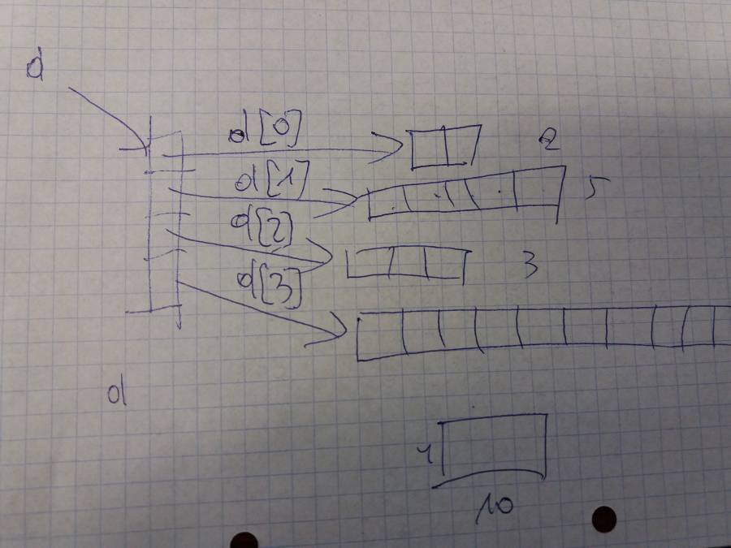

# Laboratorium 2

Klasa Matrix jest macierzą dwuwymiarową, ale dane przechowuje w tablicy jednowymiarowej data. Informacja o liczbie wierszy i kolumn jest zawarta w polach `rows` i `cols`

```java
public class Matrix {
    double[] data;
    int rows;
    int cols;

    Matrix(int rows, int cols) {
        this.rows = rows;
        this.cols = cols;
        data = new double[rows * cols];
    }

    //...
}
```

Celem ćwiczenia jest implementacja różnych metod klasy Matrix. Na następnych zajęciach będą one testowane.

## 2.1 Zaimplementuj konstruktor

```java
Matrix(double[][] d) {...}
```

tworzący macierz na podstawie tablicy - liczba kolumn ma być ustalona na podstawie najdłuższego wiersza w d, brakujace elementy zerowe.

```java
Matrix m = new Matrix(new double[][]{{1,2,3,4},{5,6},{7,8},{9}});
```



## 2.2 Zaimplementuj metodę która zwraca tablicę dwuwymiarową

```java
double[][] asArray() {...}
```

## 2.3 Zaimplementuj metody dostępu do elementów (settery i gettery)

Sprawdź zakresy wierszy i kolumn. Zasygnalizuj błąd, jak w punkcie 2.5

```java
double get(int r,int c) {...}
void set(int r, int c, double value) {...}
```

## 2.4 Zaimplementuj metodę `toString`

Publiczna funkcja `toString` powinna zwracać tekstową reprezentację obiektu. Klasa `String` jest niemodyfikowalna (*immutable*), dlatego do przygotowania tekstu użyj klasy `StringBuilder`. Obiekty tej klasy są modyfikowalne i bufor dla tekstu może automatycznie przyrastać w miarę dodawania kolejnych fragmentów. Przeciążona metoda `append()` pozwala na dopisywania tekstowej reprezentacji obiektów różnych typów (`String`, `Object`, `double`, `float`, `int`, itd.)

```java
public String toString() {
    StringBuilder buf = new StringBuilder();
    buf.append("[");
    for (int i = 0; i < rows; i++) {
        buf.append("[");
        //...
    }
    //...
    return buf.toString();
}
```

## 2.5 Zaimplementuj metodę `reshape`

```java
void reshape(int newRows, int newCols) {
    if (rows * cols != newRows * newCols) {
        throw new RuntimeException(String.format("%d x %d matrix can't be reshaped to %d x %d", rows, cols, newRows, newCols));
    }

    //...
}
```
Na razie informuj o błędach za pomocą wyjątku `RuntimeException`. Jest to bardzo niewłaściwe i żaden programista Javy nigdy nie powinien tego robić. :wink: Ale niektórzy tak robią i zostaje w bibliotekach na długie lata.

## 2.6 Zaimplementuj metodę `shape`

Metoda powinna zwracać tablicę określającą liczbę wierszy i kolumn

```java
int[] shape() {...}
```

## 2.7 Zaimplementuj metodę `add`

```java
Matrix add(Matrix m) {...}
```
Zwraca ona macierz, której elementy spełniają

```java
assert get(i,j) == this.get(i,j)+m.get(i,j)
```

## 2.8 Analogicznie zaimplementuj metody

```java
Matrix sub(Matrix m) {...}
Matrix mul(Matrix m) {...}
Matrix div(Matrix m) {...}
```

oraz dodawanie, mnożenie, dzielenie, odejmowanie skalarów

```java
Matrix add(double w) {...} // dodaje wartość w do każdego elementu
Matrix sub(double w) {...} // odejmuje wartośc w od kazdego elementu
Matrix mul(double w) {...} // mnoży każdy element przez skalar w
Matrix div(double w) {...} // dzieli każdy element przez skalar w
```

## 2.9 Zaimplementuj zwykłe mnożenie macierzy

W wyniku pomnożenia A(r x n) * B(n x m) ma powstać macierz C(r x m)

```java
Matrix dot(Matrix m) {...}
```

## 2.10 Zaimplementuj normę Frobeniusa

Norma Frobeniusa to po prostu suma kwadratów elementów. [https://en.wikipedia.org/wiki/Matrix_norm#Frobenius_norm](https://en.wikipedia.org/wiki/Matrix_norm#Frobenius_norm)

```java
double frobenius() {...}
```

Czyli jeżeli odejmiemy macierz od siebie - to powinna powtać macierz o zerowej normie Frobeniusa. Jeśli podzielimy przez siebie - norma powinna wynosić `rows` * `cols`

## 2.11 Metody statyczne budujące macierze

Często spotykaną konwencją jest stosowanie metod statycznych, które tworzą skonfigurowany obiekt Zaimplementuj typowe metody:

```java
public static Matrix random(int rows, int cols){
    Matrix m = new Matrix(rows, cols);
    Random r = new Random();
    m.set(0, 0, r.nextDouble());
    //... wypełnij wartościami losowymi
    return m;
}
```

Wywołanie:

```java
Matrix r = Matrix.random(2,3);
```

Macierz jednostkowa

```java
public static Matrix eye(int n){
    Matrix m = new Matrix(n, n);
    //... wypełnij jedynkami na przekątnej        
    return m;
}
```

## 2.12 Opcjonalnie: wyznacznik macierzy kwadratowej

Oblicz wyznacznik sprowadzając wpierw macierz do postaci trójkątnej za pomocą eliminacji Gaussa

:heavy_exclamation_mark: Za to zadanie otrzymasz punkty dodatkowe

## 2.13 Opcjonalnie: odwracanie macierzy

Napisz metodę `inv()` zwracającą odwrotność macierzy. Macierz może być również odwrócona metodą eliminacji Gaussa.

:heavy_exclamation_mark: Za to zadanie otrzymasz punkty dodatkowe

Znalazłem gdzieś na dysku stary kod w C++ z 1995 roku. Może się przydać jako źródło inspiracji… Wydaje mi się, że działał?

- Konstruktor tworzył macierz jednostkową (z jedynkami na przekątnej)
- Pivot to element maksymalny w obszarze do eliminacji
- Nie chcemy wersji in place. Po prostu wynikowa macierz ma być zwracana
- Testy - pomnóż wektor przez macierz i następnie jej odwrotność i sprawdź, czy osiągnięto wartość wyjściową. Albo pomnóż macierz przez odwrotność i sprawdź, czy wynikowa macierz jest jednostkowa.

```cpp
void Matrix::swapRows(int i1, int i2)
{
    for (int j = 0; j < n; j++) {
        double tmp = x[i1][j];
        x[i1][j] = x[i2][j];
        x[i2][j] = tmp;
    }
}

void Matrix::invert()
{
    int i, j, k;
    Matrix out(n);
    for(i = 0; i < n; i++) {
        // Find pivot row
        double max = fabs(x[i][i]);
        int pivot = i;
        for (k = i; k < n; k++) {
            if (max < fabs(x[k][i])) {
                max = fabs(x[k][i]);
                pivot = k;
            }
        }
        
        if(i != pivot) swapRows(i, pivot);
        if(i != pivot) out.swapRows(i, pivot);
        
        if (x[i][i] != 1.0) {
            double divby = x[i][i];
            if (fabs(divby) > verySmall) {
                for (j = 0; j < n; j++) {
                    out.x[i][j] /= divby;
                    x[i][j] /= divby;
                }
            } else {
                throw -1;
            }
        }

        for(j = 0; j < n; j++){
            if(j != i) {
                if(x[j][i] != 0) {
                    double mulby = x[j][i];
                    for(k=0; k < n; k++) {
                        x[j][k] -= mulby * x[i][k];
                        out.x[j][k] -= mulby * out.x[i][k];
                    }
                }
            }
        }
    }

    *this = out;
}
```
